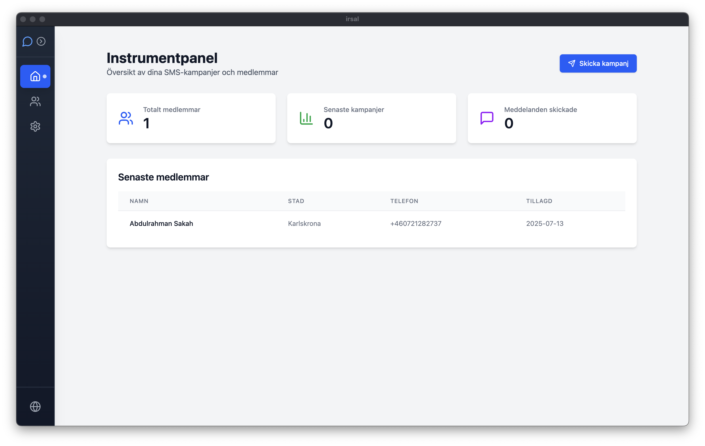

# Irsal - Community SMS Management System

<div align="center">
  
</div>

## 📱 About Irsal

**Irsal** (Arabic: إرسال, meaning "sending") is a modern, multilingual desktop application designed for community organizations, mosques, and religious institutions to efficiently manage their members and send SMS campaigns. Built with Electron, React, and TypeScript, Irsal provides a user-friendly interface that supports Arabic, Swedish, and English languages.

### ✨ Key Features

- **📊 Member Management**: Add, edit, and organize community members with contact information
- **📱 SMS Campaigns**: Send bulk SMS messages to all members or selected groups via Twilio
- **🤖 AI-Powered Translation**: Automatic bilingual message creation with DeepSeek AI (Arabic ↔ Swedish)
- **🌍 Multilingual Support**: Full interface localization in Arabic, Swedish, and English
- **📈 Dashboard Analytics**: View member statistics and campaign history
- **📋 Data Management**: Import/export member data via CSV files
- **⚙️ Settings Management**: Configure Twilio SMS and DeepSeek AI settings
- **🗄️ Local Database**: Secure SQLite database for offline data storage

### 🎯 Perfect For

- **Mosques & Islamic Centers**: Send prayer time updates, event announcements
- **Community Organizations**: Member communication and event coordination
- **Religious Institutions**: Multilingual community outreach
- **Non-profits**: Volunteer coordination and updates

## 🚀 Getting Started

### Prerequisites

- **Node.js** (v18 or higher)
- **npm** or **yarn**
- **Twilio Account** (for SMS functionality)
- **DeepSeek API Key** (for AI translation)

### Installation

1. **Clone the repository**
   ```bash
   git clone https://github.com/abodsakah/Irsal.git
   cd Irsal
   ```

2. **Install dependencies**
   ```bash
   npm install
   ```

3. **Configure your settings** (via the app's Settings page after first run)
   - Twilio credentials (Account SID, Auth Token, Phone Number)
   - DeepSeek API key for translation

### 🛠️ Development

**Start the development server:**
```bash
npm run dev
```

This will start both the Vite development server and Electron app in development mode with hot reload.

**Build for production:**
```bash
npm run build
```

**Lint the code:**
```bash
npm run lint
```

### 📦 Building Distribution

The app uses `electron-builder` to create distributable packages:

```bash
npm run build
```

This will create platform-specific installers in the `release/` directory.

## 📋 Usage Guide

### 1. Initial Setup
- Open the app and navigate to **Settings**
- Configure your **Twilio credentials** for SMS functionality
- Add your **DeepSeek API key** for AI translation

### 2. Managing Members
- Go to the **Members** page
- Add members manually or import from CSV
- Edit member information as needed
- Export member data for backup

### 3. Sending SMS Campaigns
- Navigate to the **Home** dashboard
- Click **"Send Campaign"**
- Write your message in Arabic or Swedish
- Use the **AI Translate** button (✨) to create bilingual messages
- Send to all members with one click

### 4. AI Translation
The AI translation feature automatically:
- Detects the language of your input
- Creates bilingual messages in this format:
  ```
  [Swedish text]
  
  [Arabic text]
  ```

## 🛡️ Privacy & Security

- **Local Data Storage**: All member data is stored locally in SQLite
- **Secure Credentials**: API keys and tokens are encrypted in the local database
- **No Cloud Dependencies**: Works completely offline except for SMS sending and translation

## 🌐 Supported Languages

- **🇬🇧 English** - Full interface and documentation
- **🇸🇪 Swedish** - Complete localization for Swedish communities
- **🇸🇦 Arabic** - Right-to-left interface support with Arabic localization

## 🧰 Tech Stack

- **Frontend**: React 18, TypeScript, Tailwind CSS
- **Backend**: Electron, Node.js
- **Database**: SQLite with better-sqlite3
- **SMS Service**: Twilio API
- **AI Translation**: DeepSeek API
- **Internationalization**: react-i18next
- **Icons**: Lucide React
- **Build Tools**: Vite, electron-builder

## 📄 Project Structure

```
Irsal/
├── src/                    # React frontend source
│   ├── components/         # Reusable UI components
│   ├── pages/              # Main application pages
│   ├── services/           # API and database services
│   ├── i18n/              # Internationalization files
│   └── main.tsx           # React entry point
├── electron/               # Electron main process
│   ├── main.ts            # Electron main entry
│   └── preload.ts         # Preload scripts
├── src/main/              # Database and IPC handlers
│   ├── database.ts        # SQLite database logic
│   └── ipcHandlers.ts     # Inter-process communication
└── public/                # Static assets
```

## 🤝 Contributing

We welcome contributions! Please feel free to submit a Pull Request. For major changes, please open an issue first to discuss what you would like to change.

## 📞 Support

If you encounter any issues or need help:
1. Check the **Settings** page to ensure your credentials are correct
2. Review the console logs in the app's developer tools
3. Create an issue on GitHub with detailed information

## 📜 License

This project is licensed under the MIT License - see the [LICENSE](LICENSE) file for details.

---

**Made with ❤️ for community organizations worldwide**